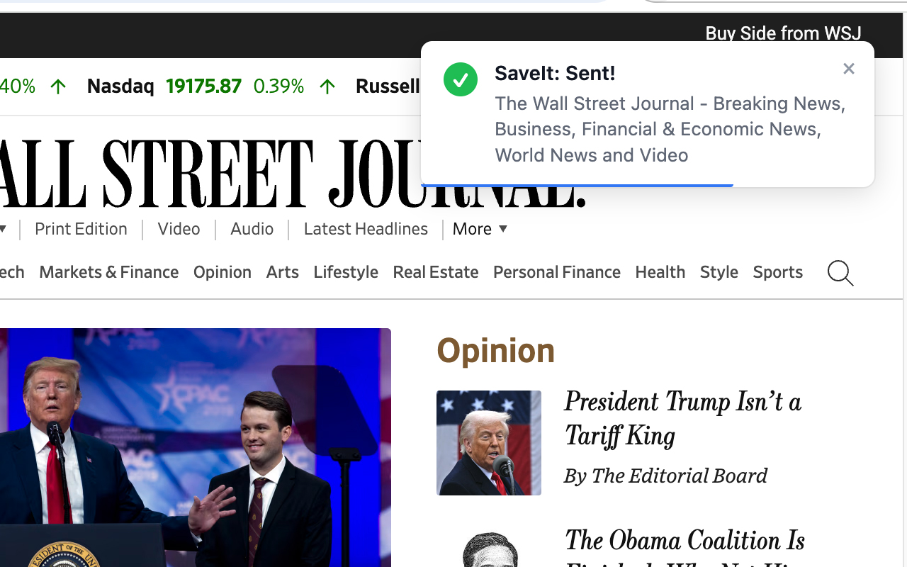
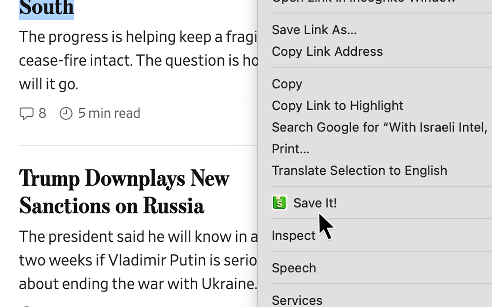
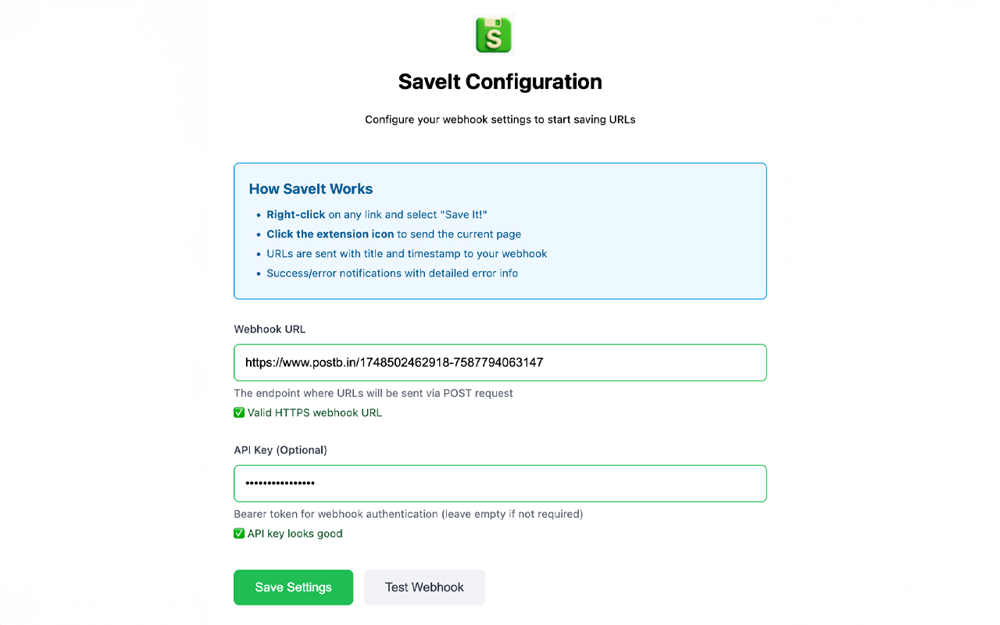

# SaveIt - Webhook Manager Chrome Extension

[](https://opensource.org/licenses/MIT)
[](https://chrome.google.com/webstore/detail/dkebanddacekoaemedabedngnokpmeep)
[](https://github.com/GeoffreyPlitt/saveit/actions)
[](https://codecov.io/gh/GeoffreyPlitt/saveit)

### Send web pages and links to your configured webhook with one click. Perfect for saving content to your personal systems.

**🚀 [Install from Chrome Web Store](https://chrome.google.com/webstore/detail/dkebanddacekoaemedabedngnokpmeep)**

> 📱 **Note:** For Android users, we have a companion sharing tool available at https://geoffreyplitt.github.io/saveit/ that adds SaveIt as a share target option in Android's system share menu to accomplish similar functionality.

## Screenshots

<a href="./screenshots/1.jpg"></a>
<a href="./screenshots/2.jpg"></a>
<a href="./screenshots/3.jpg"></a>

## Features

**SaveIt** is a minimalist Chrome extension that instantly sends web pages and links to your personal webhook endpoint. Whether you're building a personal knowledge base, feeding content to automation systems, or integrating with custom applications, SaveIt helps you
save those links you never want to lose.

Key Features:
- **Right-click** any link and select **"Save It!"** to capture URLs instantly
- **Click the toolbar icon** to save the **current page** you're viewing
- **Structured JSON data** is sent to the webhook, including URL, page title, and timestamp
- **Secure Bearer token authentication** for your webhook endpoints
- **Visual notifications** confirm successful saves or alert you to errors
- **Automatically syncs** your webhook setting across all your Chrome instances
- **Zero dependencies** - lightweight and **fast**

Perfect for developers, researchers, content curators, and anyone who needs to quickly capture web content into their personal systems or workflows. Simply configure your webhook URL once, and start saving content with a single click.

## Technical Specifications

### Core Architecture
- **Manifest V3** Chrome extension
- **Vanilla JS/HTML/CSS** - Zero dependencies
- **Webhook Integration** with Bearer token authentication
- **Error Handling** with detailed error logging and user notifications

### JSON Payload Format
```json
{
  "url": "https://example.com",
  "title": "Example Page",
  "timestamp": "2024-05-28T00:00:00.000Z"
}
```

## Installation

### From Chrome Web Store (Recommended)
1. Visit the [SaveIt Chrome Web Store page](https://chrome.google.com/webstore/detail/dkebanddacekoaemedabedngnokpmeep)
2. Click "Add to Chrome"
3. Configure your webhook settings by right-clicking the extension icon → "Options"

### From Source (Development)
1. Clone this repository:
   ```bash
   git clone https://github.com/GeoffreyPlitt/saveit.git
   cd saveit
   ```

2. Load unpacked extension in Chrome:
   - Open Chrome and navigate to `chrome://extensions/`
   - Enable "Developer mode" in the top right
   - Click "Load unpacked" and select the `saveit` directory

3. Configure your webhook:
   - Right-click the SaveIt icon in the toolbar
   - Select "Options"
   - Enter your webhook URL and Bearer token
   - Click "Save"

## Usage

### Send Current Page
- Click the SaveIt icon in the Chrome toolbar

### Send Specific Link
- Right-click any link on a webpage
- Select "Save It!" from the context menu

### Configure Settings
- Right-click the extension icon → "Options"
- Enter webhook URL and Bearer token
- Settings automatically sync across your Chrome instances

### Testing Tools

For testing webhook functionality, we recommend using [postb.in](https://www.postb.in) - a free tool for creating short-lived disposable webhooks. It shows you all requests it receives, making it perfect for testing the extension's webhook integration without setting up your own server.

Simply:
1. Visit https://www.postb.in and create a new bin
2. Copy the provided webhook URL
3. Use it in the extension's options page
4. Test the extension and view the received requests on postb.in

### Testing

We use Jest for unit testing with Docker to ensure consistent test environments both locally and in CI.

#### Running Tests with Docker (Recommended)

```bash
# Build the Docker image
docker build -t saveit-test .

# Run tests in Docker
npm run docker:test

# Run linting in Docker
npm run docker:lint

# Run tests with coverage in Docker
npm run docker:coverage
```

#### Running Tests Locally (without Docker)

```bash
# Install dependencies
npm install

# Run tests
npm test

# Run linting
npm run lint

# Run tests with coverage report
npm test -- --coverage
```

The tests focus on core functionality:
- Simple fetch mechanism for webhook requests
- Chrome storage API interactions
- Background service worker event handling
- Webhook sending functionality

## License

This project is licensed under the MIT License - see the [LICENSE](LICENSE) file for details.

## Contributing

1. Fork the repository
2. Create a feature branch (`git checkout -b feature/amazing-feature`)
3. Commit your changes (`git commit -m 'Add amazing feature'`)
4. Push to the branch (`git push origin feature/amazing-feature`)
5. Open a Pull Request
